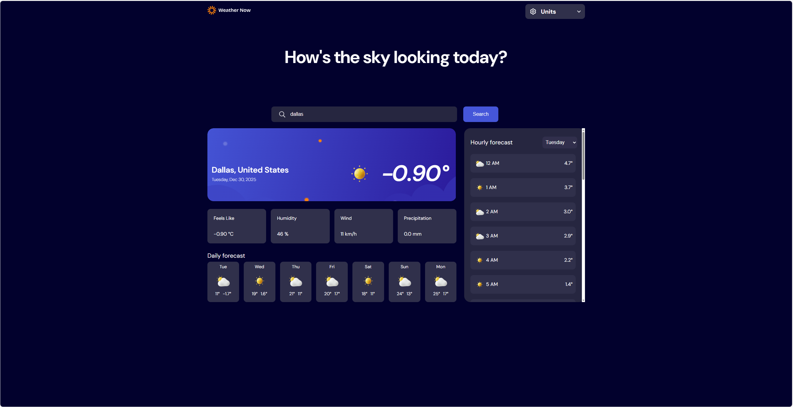
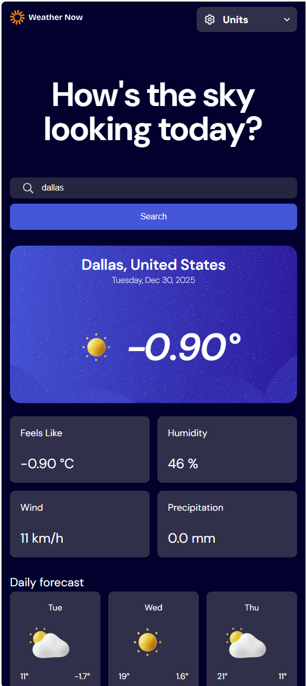

# Frontend Mentor - Weather app solution

This is a solution to the [Weather app challenge on Frontend Mentor](https://www.frontendmentor.io/challenges/weather-app-K1FhddVm49). Frontend Mentor challenges help you improve your coding skills by building realistic projects. 

## Table of contents

- [Overview](#overview)
  - [The challenge](#the-challenge)
  - [Screenshot](#screenshot)
  - [Links](#links)
- [My process](#my-process)
  - [Built with](#built-with)
  - [Instructions to Run](#run)
  - [What I learned](#what-i-learned)
  - [Continued development](#continued-development)
  - [Useful resources](#useful-resources)
- [Author](#author)
- [Acknowledgments](#acknowledgments)


## Overview

### The challenge

Users should be able to:

- Search for weather information by entering a location in the search bar
- View current weather conditions including temperature, weather icon, and location details
- See additional weather metrics like "feels like" temperature, humidity percentage, wind speed, and precipitation amounts
- Browse a 7-day weather forecast with daily high/low temperatures and weather icons
- View an hourly forecast showing temperature changes throughout the day
- Switch between different days of the week using the day selector in the hourly forecast section
- Toggle between Imperial and Metric measurement units via the units dropdown 
- Switch between specific temperature units (Celsius and Fahrenheit) and measurement units for wind speed (km/h and mph) and precipitation (millimeters) via the units dropdown
- View the optimal layout for the interface depending on their device's screen size
- See hover and focus states for all interactive elements on the page

### Screenshot




### Links

- Solution URL: [Add solution URL here](https://your-solution-url.com)
- Live Site URL: [Add live site URL here](https://your-live-site-url.com) // To be updated

## My process

### Built with

- Semantic HTML5 markup
- CSS custom properties
- Flexbox
- CSS Grid
- Mobile-first workflow
- [Vue.js via CDN](https://vuejs.org/) - Vue Framework


### Instructions to run manually
1. Navigate to main directory (with server.js file)
2. Start the node server: 'node server.js'
3. Open the Index.html file within a browser of your choice.

### What I learned

Ultimate Goal: To become a master at using software tools to solve problems. 
Details: At the moment my goals involve mastering frontend, backend (where I have much more experience), deployment on a vps server,
database integration, automated CI/CD workflows & scalability.

I learned a LOT during this project. 
CSS- layers and how to use them to organize.
   - More than I need about calculating selector specificity
   - Very useful patterns in efficiently structuring html and css-grid inorder to quickly make a site layout *** 
   - That I can import my own fonts via font-face and that is more performant
   - Many useful frontend resources on best-practices, tips, and tools, and paradigms for thinking about frontend 
     - e.g.https://www.accessibility-developer-guide.com/knowledge/colours-and-contrast/
     - https://css-tricks.com/striking-a-balance-between-native-and-custom-select-elements/ (I used this to make the 
       select dropdown).
   - Amongst many many other useful css techniques.
   - That I do NOT need necessarily need additional dependencies such as scss, and css can do a lot of what was previously 
        not possible (nesting pseudo classes with &, variables etc.)

Expressjs- How to set up a quick webserver. This will be paired with other system tools (systemd & nginx) 
to enable a professional site that can handle a reasonable amount of load and restart automatically.

Javascript: The nuances of how imports work/dont work (e.g. when we exactly one is unable to use 'require') and how to
navigate around that limitation with vue by passing the import into the template as a data.

Vuejs - While I am already comfortable with Vue. This task/project has helped me gain greater proficiency. 


```html
<h1>Some HTML code I'm proud of</h1>
Refined my general approach for layout out a site quickly.
<div class="container">   // <--- For structuring the site vertically into 'space/margin content space/margin' using css grid
    <div class="container_main">  // <-- For structuring the site horizontally using a combination of fractions and fixed values with template rows 
        content
    </div>
</div>
```


## Author

- Website - [Sopeade Lanlehin](https://www.sopelanlehin.com)
- Frontend Mentor - [@yourusername](https://www.frontendmentor.io/profile/yourusername)

## Acknowledgments

I utilized Sandrina's approach(https://css-tricks.com/striking-a-balance-between-native-and-custom-select-elements/) 
in styling the select element. 

I watched many youtube videos for practice in using css-grid.
